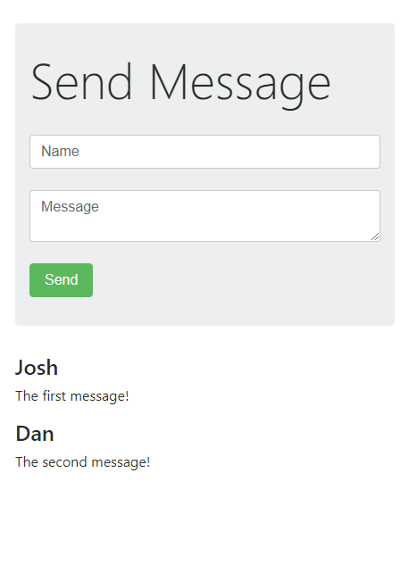

# Node.js Chat App

This is a basic chat app I built during a node.js course. It uses mongodb, express.js and socket.io, plus jasmine for automated tests. It was exciting to see how reliable test-driven development can be. This was also my first experience with a NoSQL database and I'm intrigued to learn more.
  

